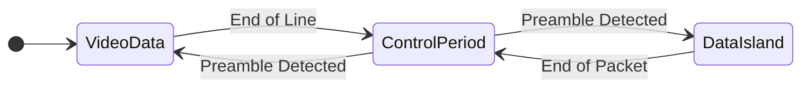
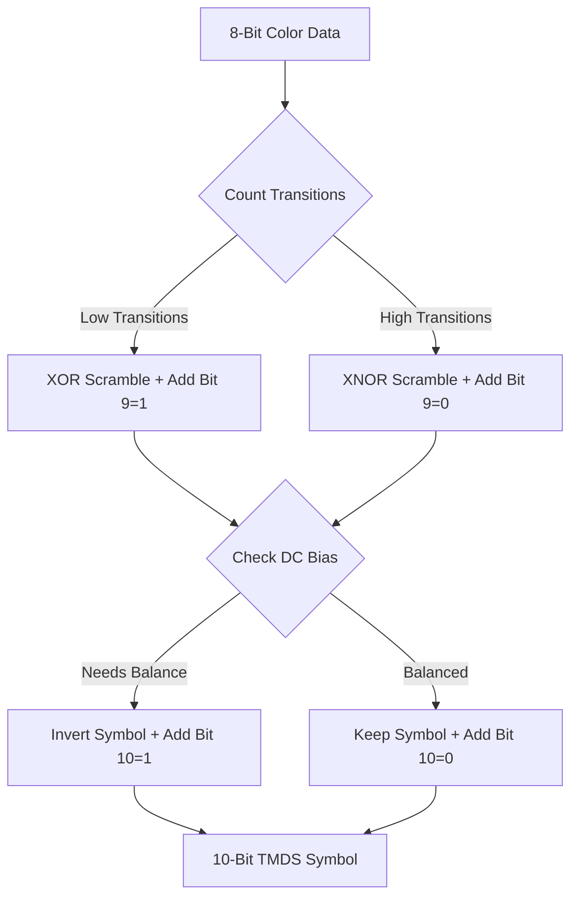

This is a comprehensive, deep-dive "Master Class" on HDMI and TMDS. It is designed to take you from zero knowledge to having the complete mental model required to implement a bit-banged HDMI transmitter (like on a Raspberry Pi Pico).

We will start with the generic theory (applicable to any HDMI source, like a GameCube or DVD player) and then dedicate a specific chapter to the RP2040/RP2350 implementation.

---

# Phase 1: The Physical Layer (The Electrical Reality)

Before we talk about bits and bytes, we must understand the wires. HDMI is a high-speed serial interface. It does not send all data at once; it streams it incredibly fast.

### 1. The Differential Signaling

Standard logic uses 0V for `0` and 3.3V for `1`. This is "Single Ended." It is vulnerable to noise. If a motor turns on nearby, the wire's voltage might spike, turning a `0` into a `1`.

HDMI uses **TMDS (Transition Minimized Differential Signaling)** over **Twisted Pair** wires.

- **Wire A (Positive):** Carries the signal.
- **Wire B (Negative):** Carries the _inverse_ of the signal.
- **The Receiver:** Measures $(A - B)$.

Why? If noise hits the cable, it hits both wires equally.

$(A + noise) - (B + noise) = A - B$. The noise cancels out mathematically. This allows HDMI to run at hundreds of Megahertz.

### 2. The Four Lanes

An HDMI cable has 19 pins, but the core video/audio transmission happens on just **4 discrete channels** (8 wires total).

| **Channel**   | **Color Component** | **Other Roles**                         |
| ------------- | ------------------- | --------------------------------------- |
| **Channel 2** | **Red**             | Data Islands (Audio)                    |
| **Channel 1** | **Green**           | Data Islands (Audio)                    |
| **Channel 0** | **Blue**            | HSYNC, VSYNC, Data Islands (Audio)      |
| **Clock**     | **Pixel Clock**     | The metronome synchronizing the other 3 |

---

# Phase 2: The Protocol Structure (The Big Picture)

HDMI is a state machine. The "State" determines how the 1s and 0s on the wire are interpreted. There are three distinct states (Periods).

Code snippet

### 1. Video Data Period (The Pixels)

- **Active:** When drawing the visible part of the screen.
- **Encoding:** **TMDS 8b/10b**.
- **Payload:** RGB colors.

### 2. Data Island Period (The Audio/Aux)

- **Active:** During the "blanking" (black borders) around the video.
- **Encoding:** **TERC4** (TMDS Error Reduction Coding).
- **Payload:** Audio samples, InfoFrames.

### 3. Control Period (The Sync)

- **Active:** Between Video and Data Islands.
- **Encoding:** **Fixed Control Tokens** (2 bits mapped to 10 bits).
- **Payload:** HSYNC (Horizontal Sync), VSYNC (Vertical Sync), and Preambles.

---

# Phase 3: TMDS Encoding Deep Dive

This is the most critical section for implementation. You cannot simply send a byte of data. You must transform it.

### Why do we encode?

1. **DC Balance:** If you send too many 1s, the cable charges up (DC bias), corrupting the signal. We need roughly equal 1s and 0s.
2. **Transition Minimization:** We want _fewer_ transitions (0->1 or 1->0) to reduce electromagnetic interference (EMI) and make the signal easier to read.

## Algorithm A: Video Data (8b/10b)

This algorithm turns 8 bits of color into a 10-bit symbol.

**The Logic Flow:**

1. **Step 1 (Minimize Transitions):** Look at the 8-bit byte. Do we have more transitions if we XOR the bits or XNOR them? Pick the one with fewer transitions. Append a 9th bit to say which logic we used.
2. **Step 2 (DC Balance):** Look at the running count (Disparity) of 1s and 0s sent so far. If we have sent too many 1s, and the new symbol has many 1s, we **invert** the entire symbol (turn 1s to 0s) to balance it out. Append a 10th bit to say if we inverted it.

Code snippet

_Implementation Note:_ For 480p, pre-calculating a look-up table (LUT) of 256 entries for this is much faster than calculating it live.

## Algorithm B: Control Period (2b/10b)

During the blanking interval, we send synchronization signals. These use strictly defined patterns that contain **lots of transitions** (so the receiver can easily lock onto the clock).

Only **Channel 0 (Blue)** carries Sync signals. Channels 1 and 2 transmit "Control" signals (usually preamble bits) during this time.

| **Input (D1, D0)** | **Meaning**  | **10-Bit Output Pattern** |
| ------------------ | ------------ | ------------------------- |
| 0, 0               | Idle         | `1101010100`              |
| 0, 1               | HSYNC Active | `0010101011`              |
| 1, 0               | VSYNC Active | `0101010100`              |
| 1, 1               | Both Active  | `1010101011`              |

## Algorithm C: TERC4 (4b/10b for Audio)

Data Islands (Audio) use a completely different encoding called **TERC4**. It maps 4 bits of input to a 10-bit symbol.

- **Why?** It is extremely robust against errors. These symbols are chosen because they have a high "Hamming Distance" from each other, making them less likely to be confused if a bit flips.
- **Usage:** Used for Audio Samples and Header info.

| **Input (4-bit)** | **10-Bit Output Pattern** | **Input (4-bit)** | **10-Bit Output Pattern** |
| ----------------- | ------------------------- | ----------------- | ------------------------- |
| 0 (0000)          | `1010011100`              | 8 (1000)          | `1011001100`              |
| 1 (0001)          | `1001100011`              | 9 (1001)          | `0100111011`              |
| 2 (0010)          | `1011100100`              | 10 (1010)         | `0110011100`              |
| 3 (0011)          | `1011100010`              | 11 (1011)         | `1011000111`              |
| 4 (0100)          | `0101110001`              | 12 (1100)         | `1010011011`              |
| 5 (0101)          | `0100011110`              | 13 (1101)         | `1001110001`              |
| 6 (0110)          | `0110001110`              | 14 (1110)         | `0101100011`              |
| 7 (0111)          | `0100111100`              | 15 (1111)         | `1011000110`              |

---

# Phase 3.5: Transitions & The Guard Band

The TV's decoder needs help knowing exactly when a "Video Period" or "Data Island Period" starts. It cannot just jump from Control tokens to Pixels.

### 1. The Preambles (The Warning)

Before every Video or Data Island period, we must send a **Preamble**. This is 8 clocks of a specific "Control" pattern.

- **Video Preamble:** Tells the TV "Get ready, pixels are coming."
  - Pattern (CTL0,1,2,3): `1, 0, 0, 0`
- **Data Island Preamble:** Tells the TV "Get ready, audio/metadata is coming."
  - Pattern (CTL0,1,2,3): `1, 0, 1, 0`

### 2. The Guard Band (The Handshake)

Immediately after the preamble, and before the first byte of data, we send **2 clocks of Guard Band**. These are fixed 10-bit patterns that act as a "start bit" for the high-speed data.

| **Channel**           | **Video Guard Band** | **Data Island Guard Band** |
| --------------------- | -------------------- | -------------------------- |
| **Channel 0 (Blue)**  | `1011001100`         | `0100110011`               |
| **Channel 1 (Green)** | `0100110011`         | _First 4 bits of Data_     |
| **Channel 2 (Red)**   | `1011001100`         | `0100110011`               |

---

# Phase 4: The Data Island (Audio & InfoFrames)

This is the hardest part of the protocol. Data (Audio, Metadata) isn't a continuous stream; it is chopped into **32-pixel-clock Packets**.

### 1. The Packet Structure

Every packet is exactly 32 clocks long and carries 4 **Subpackets**.

- **Clock 0:** Packet Header.
- **Clocks 1-28:** Subpacket Data (4 subpackets x 7 bytes each = 28 bytes).
- **Clocks 29-31:** Trailing/Null.

### 2. The Packet Header (HB)

The header tells the TV what kind of packet this is. It consists of 3 bytes + 1 parity byte (BCH).

| **Byte** | **Name**    | **Description**                                                            |
| -------- | ----------- | -------------------------------------------------------------------------- |
| HB0      | Packet Type | `0x02` (AVI InfoFrame), `0x81` (Audio Clock Regen), `0x82` (Audio Sample). |
| HB1      | Version     | Usually `0x01` or `0x02`.                                                  |
| HB2      | Length      | Number of valid bytes in the payload.                                      |
| HB3      | Parity      | Calculated using a BCH(32, 24) code.                                       |

### 3. The AVI InfoFrame (The "Identity Card")

Modern TVs are picky. If you don't send an **AVI (Auxiliary Video Information) InfoFrame**, the TV might assume the wrong aspect ratio or refuse to show a picture. It tells the TV the color space (RGB vs YCbCr) and the resolution (VIC).

### 4. Audio Flow (PCM Stereo)

To send stereo audio (PCM), you must package samples into these structures.

1. **Subpackets:** Each packet contains 4 "Subpackets". A stereo sample (16-bit Left + 16-bit Right) is split across these.
2. **Clock Regeneration (The N/CTS Puzzle):**
   The TV does not know your audio sample rate (e.g., 44.1kHz). It only sees the 25.2MHz video clock. You must tell the TV how to rebuild the audio clock using the **N** and **CTS** values.

$$AudioFreq = \frac{PixelClock \times N}{128 \times CTS}$$

| **Audio Rate** | **Pixel Clock** | **N** | **CTS** |
| -------------- | --------------- | ----- | ------- |
| 44.1 kHz       | 25.2 MHz        | 6272  | 28000   |
| 48.0 kHz       | 25.2 MHz        | 6144  | 25200   |

---

# Phase 5: Video Timing (The Raster)

The TV draws the screen left-to-right, top-to-bottom. Even when it isn't drawing pixels, the protocol is running (sending blanking data).

For **480p (640x480 @ 60Hz)**, the timing is:

- **Pixel Clock:** 25.2 MHz (or 25.175 MHz).
- **Total Width:** 800 clocks.
- **Total Height:** 525 lines.

**The Horizontal Scanline (800 clocks):**

1. **H-Sync (96 clocks):** Control Period. (Tell TV to go to next line).
2. **Back Porch (48 clocks):** Data Island Period. (Send Audio here).
3. **Active Video (640 clocks):** Video Data Period. (The image).
4. **Front Porch (16 clocks):** Control Period. (Get ready for Sync).

---

# Phase 6: Raspberry Pi Pico (RP2040 & RP2350) Implementation

Now we translate the theory to the Pico hardware.

### 1. The Hardware Interface

The Pico GPIOs are single-ended (0V/3.3V). HDMI requires differential (CML).

**The Resistor Hack:** Use 8 GPIO pins. Connect them to the HDMI connector via roughly 270-330 ohm resistors. The FPGA/HDMI input on the TV is current-driven; these resistors limit the current to levels that mimic the TMDS standard voltages closely enough for the TV to accept them.

### 2. System Clock Strategy

- Target Pixel Clock: 25.2 MHz.
- Bits per pixel (TMDS): 10 bits.
- Required Bitrate: $25.2 \times 10 = 252 \text{ Mbps}$.

**Overclocking:** You must overclock the Pico to **252 MHz** (or **315 MHz** for 720p). The RP2040 handles 252MHz easily, and the RP2350 is rated even higher.

### 3. RP2040 vs RP2350: Two Paths to HDMI

#### **Option A: RP2040 (The PIO Way)**

The PIO (Programmable I/O) is the hero. You use 3 State Machines (one for Blue, Green, Red).

- **Core 1** encodes raw pixels into 10-bit TMDS symbols using a LUT.
- **DMA** feeds these symbols from RAM to the PIO FIFOs.
- **PIO** shifts out the bits at 252MHz.

#### **Option B: RP2350 (The HSTX Way)**

The RP2350 (Pico 2) introduced the **HSTX (High Speed Serial Transmitter)**.

- It is a dedicated hardware block for DVI/HDMI.
- It can handle TMDS 8b/10b encoding and serialization in hardware.
- It is much more efficient than PIO and frees up those resources for other tasks.

### 4. Memory & DMA Architecture

You cannot calculate TMDS on the fly for the whole screen (not enough RAM for a full framebuffer).

**Line-based Rendering (Scanline Renderer):**

1. **Core 0:** Application logic.
2. **Core 1:** Waits for a scanline request -> Encodes pixels to TMDS LUT -> Writes to "TMDS Buffer".
3. **DMA:** Background-feeds the "TMDS Buffer" to the output (PIO/HSTX) while Core 1 works on the next line.

---

# Phase 7: Troubleshooting (Why is my screen black?)

1. **Clock Stability:** If your PLL isn't locked exactly at $10 \times PixelClock$, the TV won't sync.
2. **Preambles & Guard Bands:** Missing these is the #1 reason for "No Signal." The TV needs them to know where the data starts.
3. **EDID:** The TV communicates its capabilities via I2C (DDC lines). If you don't handle this (or provide a fake EDID), some TVs won't even turn on the HDMI port.
4. **Hot Plug Detect (HPD):** Ensure Pin 19 is pulled high (usually via a 1k resistor to 5V) to let the TV know a cable is connected.
5. **DC Bias:** If you aren't calculating the Running Disparity correctly in your LUT, the signal will "drift" and eventually drop out.
