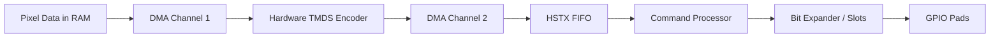
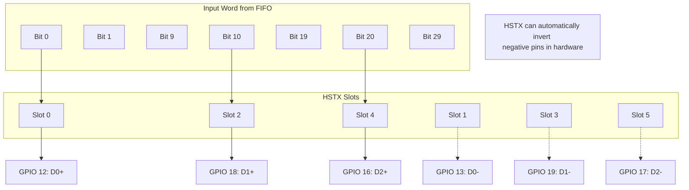

# RP2350 HSTX & Hardware TMDS Masterclass

The Raspberry Pi Pico 2 (RP2350) introduces a "Hardware Cheat Code" for digital video. While the RP2040 required clever PIO programming and heavy CPU usage to bit-bang DVI, the RP2350 has dedicated silicon designed to do exactly this.

This guide will take you through the architecture, the command language, and the implementation of a high-performance video pipeline.

---

## 1. The Big Picture: The Hardware Pipeline

On the RP2040, the CPU or PIO had to do everything. On the RP2350, the data flows through a specialized "Express Lane":

### The Two Heroes:

1.  **Hardware TMDS Encoder:** Converts 8-bit color to 10-bit TMDS symbols in 1 cycle, managing DC balance (disparity) automatically.
2.  **HSTX (High Speed Serial Transmitter): serialises** the symbols at massive speeds (up to 1.2Gbps+) and handles timing via a built-in command language.

---

## 2. Deep Dive: The Hardware TMDS Encoder

The RP2350 has three independent TMDS encoders (one for each color lane).

### How it works:

Instead of a slow software Look-Up Table (LUT), you interact with registers:

- **Input:** Write an 8-bit color value to the `TMDS_WDATA` register.
- **State:** The hardware keeps track of the "Running Disparity" (the balance of 1s and 0s) in a hidden internal register.
- **Output:** The 10-bit TMDS symbol appears in the `TMDS_RDATA` register instantly.

### Why this is a game changer:

On the RP2040, Core 1 spent **~60% of its time** just calculating TMDS symbols for a 640x480 screen. On the RP2350, this cost is effectively **0%** if you chain it with DMA.

---

## 3. Deep Dive: The HSTX Peripheral

The HSTX is the "Engine Room." It doesn't just shift bits; it follows instructions.

### The Command Processor (The "Mini-Language")

You don't just put pixels into the HSTX FIFO. You put **Instructions**.

| Command     | Action                                                       | Usage Example                                       |
| ----------- | ------------------------------------------------------------ | --------------------------------------------------- |
| **RAW**     | Shift out N bits exactly as they are in the FIFO.            | Sending actual Pixel data.                          |
| **REPLACE** | Shift out N bits, but replace specific bits with a constant. | Injecting HSYNC/VSYNC into the Blue lane.           |
| **LOOP**    | Repeat a sequence of instructions N times.                   | Drawing a solid background or repeating a scanline. |
| **NOP**     | Do nothing for N cycles.                                     | Precise timing for porches.                         |

#### **Example: Drawing a line with 2x Scaling**

If you want to draw a 320-pixel line on a 640-pixel screen, you don't need to double the data in RAM. You tell the HSTX:
`LOOP 320 { RAW 10 }` (where the internal loop logic repeats each 10-bit pixel twice).

### The Bit Expander: The "Switchboard"

The HSTX Bit Expander is like a massive patch panel. You have 32 **Slots** (output bits) and you can wire each one to any of the 32 bits in your input word.

---

## 4. Building a Frame: The HSTX Command Stream

To really understand the progression, let's look at how we build a single 640x480 scanline using nothing but HSTX commands.

### Progression of a Scanline (800 pixel clocks total)

1.  **H-SYNC (96 clocks):**
    - We don't need pixels from RAM.
    - Command: `REPLACE 96, constant=SYNC_TOKEN_BLUE`
2.  **Back Porch / Audio (48 clocks):**
    - Command: `RAW 48` (Data comes from the Audio DMA buffer).
3.  **Active Video (640 clocks):**
    - Command: `RAW 640` (Data comes from the Video DMA buffer).
4.  **Front Porch (16 clocks):**
    - Command: `REPLACE 16, constant=IDLE_TOKEN_BLUE`

### The "Loop" Trick

If you are drawing a static background (like a solid blue screen), you don't even need DMA. You can tell the HSTX:
`LOOP 640 { REPLACE 1, constant=BLUE_PIXEL }`
And it will draw the whole line without reading a single byte from RAM.

---

## 5. Implementation Progression

### Step 1: The Hardware Setup

The HSTX has optimized pins for DVI. Stick to these for the best signal integrity:

| Lane               | Positive | Negative |
| ------------------ | -------- | -------- |
| **Lane 0 (Blue)**  | GPIO 12  | GPIO 13  |
| **Clock**          | GPIO 14  | GPIO 15  |
| **Lane 2 (Red)**   | GPIO 16  | GPIO 17  |
| **Lane 1 (Green)** | GPIO 18  | GPIO 19  |

### Step 2: Configuring the HSTX Slots

You must "wire" the switchboard in code.

- You map the first 10 bits to Lane 0.
- The next 10 bits to Lane 1.
- The next 10 bits to Lane 2.

### Step 3: The DMA Chain (The "Fire and Forget")

This is the most advanced part. You setup two DMA channels:

1.  **Channel A:** Reads raw pixels from RAM -> Writes to TMDS Encoder.
2.  **Channel B:** Reads encoded symbols from TMDS Encoder -> Writes to HSTX FIFO.

Once triggered, **the CPU does nothing.** The pixels fly from RAM to the screen entirely in hardware.

---

## 5. HSTX vs PIO: Performance Comparison

| Resolution           | RP2040 (PIO)                | RP2350 (HSTX)         |
| -------------------- | --------------------------- | --------------------- |
| **640x480 (480p)**   | 60% CPU Usage (Core 1)      | ~1% CPU Usage         |
| **1280x720 (720p)**  | Impossible (Clock too high) | **Rock Solid**        |
| **Memory Bandwidth** | High (encoded data in RAM)  | Low (raw data in RAM) |

---

## 6. Pro Tips for HSTX

- **Hardware Doubling:** Use the HSTX to upscale 320x240 games to 640x480 without touching the CPU.
- **DDR Mode:** The HSTX can run in Double Data Rate mode, allowing you to hit 1.2Gbps speeds while keeping the internal clock at a manageable 600MHz.
- **Direct Drive:** Because the HSTX handles the differential signals so well, you can often skip expensive level shifters and drive HDMI directly through resistors.
